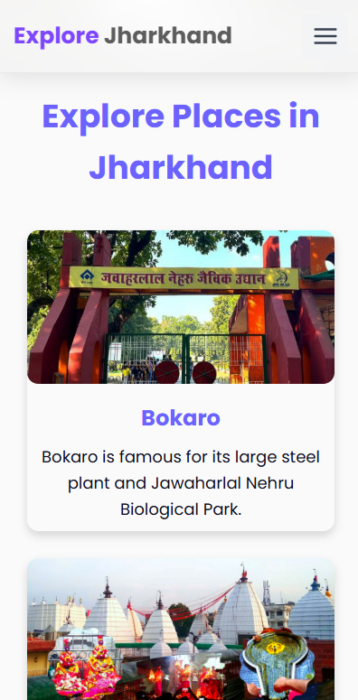
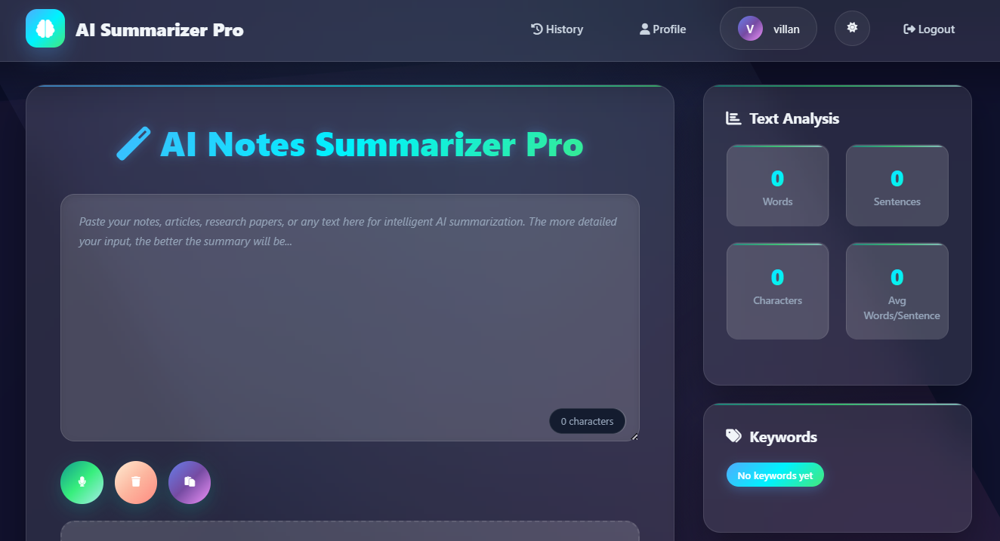
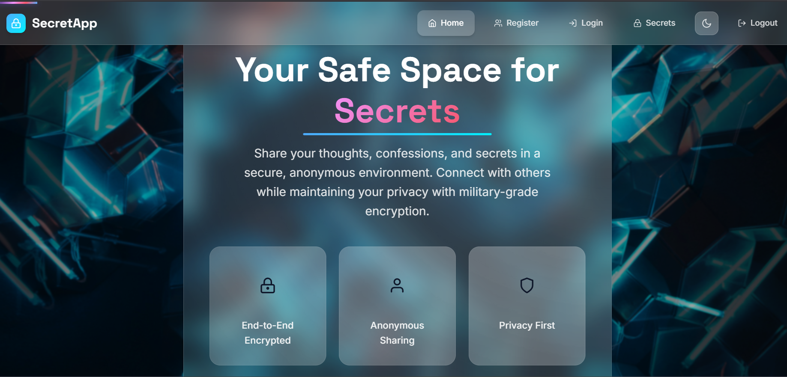
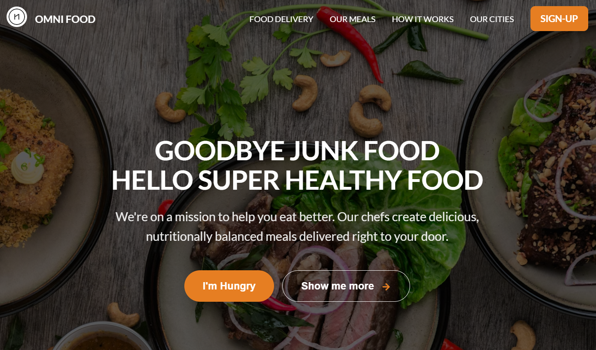
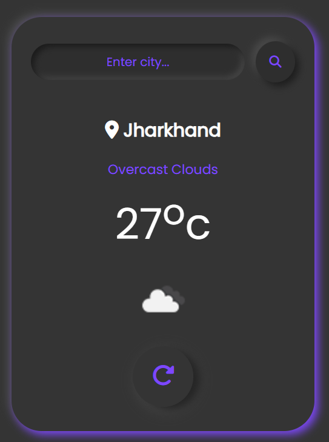
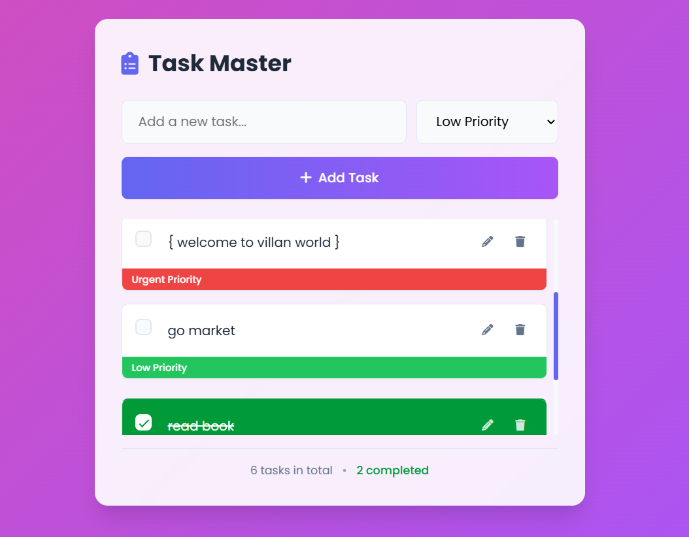

# 💼 Ankit Kumar — Full Stack Developer Portfolio

Welcome to my personal developer portfolio!  
This website highlights **who I am**, my **technical skills**, and the **real-world applications** I’ve built using modern technologies like **MERN**, **JAVA**, and more.

  
  

  

  

---
## 📌 About Me

👋 Hey there! I'm **Ankit Kumar**, a **Full Stack Web Developer** from **Jharkhand, India**.  
🎓 B.Tech in **Computer Science and Engineering** from **Jharkhand University of Technology (2021–25)**.  
💼 2+ years of freelance experience building powerful digital solutions.  

🔧 I focus on:
- Modern frontend/backend development
- Clean UI and user-friendly apps
- Performance, scalability & security

---

## 🛠️ Skills & Tools

<table width="100%">
  <tr>
    <td align="center"> <b>JavaScript</b></td>
    <td align="center"> <b>Python</b></td>
    <td align="center"> <b>React</b></td>
    <td align="center"> <b>Node.js</b></td>
    <td align="center"> <b>MongoDB</b></td>
    <td align="center"> <b>HTML5</b></td>
    <td align="center"> <b>CSS3</b></td>
  </tr>

  <tr>
    <td align="center"> <b>Bootstrap</b></td>
    <td align="center"> <b>Tailwind CSS</b></td>
    <td align="center"> <b>Git</b></td>
    <td align="center"> <b>GitHub</b></td>
    <td align="center"> <b>VS Code</b></td>
    <td align="center"> <b>Power BI</b></td>
    <td align="center"> <b>Unity</b></td>
  </tr>

  <tr>
    <td align="center"> <b>PyCharm</b></td>
    <td align="center"> <b>Linux</b></td>
    <td align="center"> <b>Figma</b></td>
    <td align="center"> <b>C</b></td>
    <td align="center"> <b>Java</b></td>
    <td align="center"> <b>JSON</b></td>
    <td align="center"> <b>MySQL</b></td>
  </tr>
</table>

---
## 📂 Featured Projects

<table>
  <tr>
    <th align="left">🧩 Project</th>
    <th align="center">🌐 Live Links</th>
  </tr>

  <tr>
    <td>
      <strong>🌍 Explore Jharkhand</strong> 
      🏞️ A tourism website that showcases famous places in Jharkhand with gallery, filtering & responsiveness.
    </td>
    <td align="center">
      
    </td>
  </tr>

  <tr>
    <td>
      <strong>🔐 Secrets Sharing App</strong> 
      🔐 A full-stack anonymous secrets-sharing app using Passport, OAuth, EJS templating, and MongoDB.
    </td>
    <td align="center">
      
    </td>
  </tr>

  <tr>
    <td>
      <strong>🧠 AI Notes Summarizer</strong> 
      🤖 A Flask + T5 NLP model app that summarizes user-uploaded notes intelligently using transformers.
    </td>
    <td align="center">
      
    </td>
  </tr>

  <tr>
    <td>
      <strong>☁️ Live Weather App</strong> 
      🌤️ Real-time weather app built with JavaScript & OpenWeather API. Clean UI & fast loading.
    </td>
    <td align="center">
      
    </td>
  </tr>

  <tr>
    <td>
      <strong>✅ Task Master</strong> 
      📋 A MongoDB-powered to-do app with full CRUD functionality for managing your daily tasks.
    </td>
    <td align="center">
      
    </td>
  </tr>

  <tr>
    <td>
      <strong>🍔 Omni Food Landing Page</strong> 
      🥗 A modern and responsive food service website built with HTML, CSS, and JavaScript.
    </td>
    <td align="center">
      
    </td>
  </tr>
</table>

## 🖼️ UI Preview

  
  
  

  
  
  

---

## 📞 Contact Me

 

<b>Made with ❤️ by Ankit Kumar</b> | © 2025 All Rights Reserved @Villan7667

